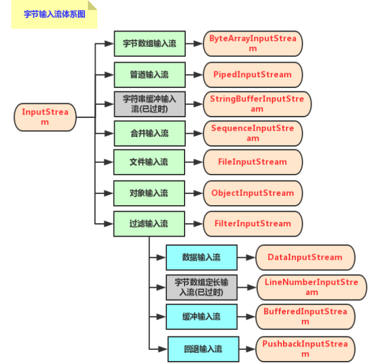
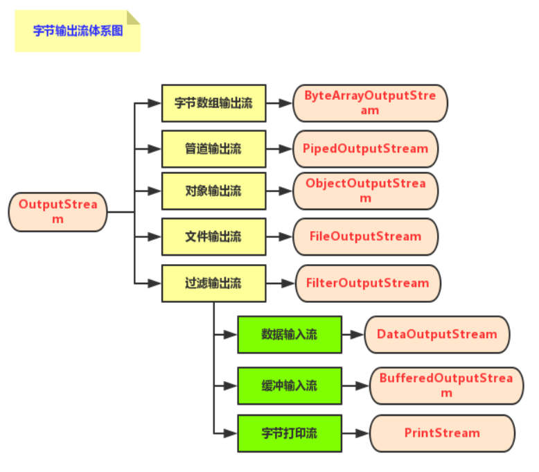
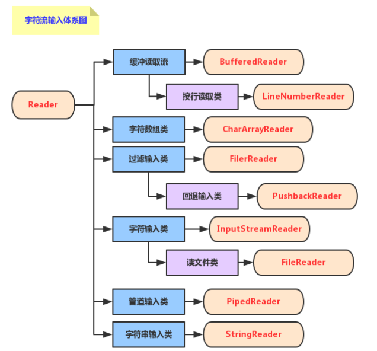
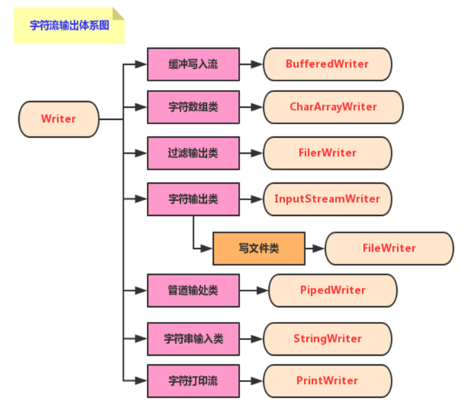

###java.io
 ####字节输入输出流
 1. 字节输入流
 
 2. 字节输出流
 
   #####FileInputStream & FileOutputStream 

***

#####使用byte[]进行接收和存储，读取返回读取字节数，返回-1表示为空

```java
package com.io;

import java.io.File;
import java.io.FileInputStream;
import java.io.FileOutputStream;

/**********
 * 字节输入输出流
 */
public class JavaFileInputStream {

    public static void main(String[] args) throws Exception {
        test01();
    }
    public static void test01() throws Exception {
        FileInputStream input = new FileInputStream(new File("C:\\Users\\28120\\Desktop\\数据库.txt"));
        FileOutputStream output  =new FileOutputStream(new File("src/aa.txt"));
        byte[] array = new byte[1024*10];
        int len = -1;
        while ((len = input.read(array))!=-1){
            String s = new String(array,0,len);
            System.out.println(s);
            output.write(array,0,len);
        }
        output.write("文件结尾".getBytes());
        output.close();
        input.close();
    }

}
```                   
***

#####ByteArrayInputStream & ByteArrayOutputStream
<p>
    ByteArrayInputStream 初始化需要一个字节数组,然后按字节只能读取
    ByteArrayOutputStream 是一个字节容器,可以直接写入byte数组，使用toByteArray()最终可以转化成byte[],也可以用toString(charset)转化成String
</p>

```java
public class JavaFileInputStream {

    public static void main(String[] args) throws Exception {
        test02();
    }
    public static void test02() throws IOException {
            byte[] info = "abcdefghigk".getBytes();
            ByteArrayInputStream inputArray = new ByteArrayInputStream(info);
            ByteArrayOutputStream outputStream = new ByteArrayOutputStream();
            outputStream.write("fasfvgfvfvbbabga".getBytes());
            outputStream.write("1234567890".getBytes());
            String s = new String(outputStream.toByteArray());
            String d = outputStream.toString("UTF-8");
            System.out.println(s);
            System.out.println(d);
        }
}
```

***

#####BufferedOutputStream & BufferedInputStream
<p>
&nbsp&nbsp&nbsp&nbsp BufferedInputStream 以inputStream初始化，可以在文件读取的时候添加缓存区，提高读取效率。<br>
&nbsp&nbsp&nbsp&nbsp BufferedOutputStream 可以在outputStream或者ByteArrayOutputStream使用，提高字节流输出效率。
</p>

``````java
public class JavaFileInputStream {

    public static void main(String[] args) throws Exception {
        test03();
    }
public static void test03() throws IOException {
        byte[] array = new byte[1024*10];
        BufferedInputStream bufferedInputStream = new BufferedInputStream(new FileInputStream(new File("src/aa.txt")));
        int len = -1;
        ByteArrayOutputStream byteArrayOutputStream= new ByteArrayOutputStream();
        BufferedOutputStream bufferedOutputStream = new BufferedOutputStream(new FileOutputStream(new File("src/bb.txt")));
        while ((len = bufferedInputStream.read(array))!=-1){
            byteArrayOutputStream.write(array,0,len);
            bufferedOutputStream.write(array,0,len);
            byteArrayOutputStream.flush();
        }
        bufferedOutputStream.close();
        bufferedInputStream.close();
        System.out.println(byteArrayOutputStream.toString("UTF-8"));
        ByteArrayOutputStream bb = new ByteArrayOutputStream();
        BufferedOutputStream b = new BufferedOutputStream(bb);
        b.write("adddddddf".getBytes());
        b.write("dasafdsfsdaf".getBytes());
        b.flush();
        System.out.println(bb.toString());
    }
}
``````
#####ObjectInputStream & ObjectOutputStream
```java
import java.io.*;
import java.util.Calendar;
import java.util.Date;
import java.util.GregorianCalendar;

public class javaObjectStream {
    public static void main(String[] args) throws IOException, ClassNotFoundException {
        test01();
    }
    public static void test01() throws IOException, ClassNotFoundException {
        //使用文件存储
        FileOutputStream fileOutputStream = new FileOutputStream(new File("src/object.txt"));
        FileInputStream fileInputStream = new FileInputStream(new File("src/object.txt"));
        BufferedInputStream bufferedInputStream = new BufferedInputStream(fileInputStream);
        BufferedOutputStream bufferedOutputStream = new BufferedOutputStream(fileOutputStream);
        //写入数据
        DataOutputStream dataOutputStream = new DataOutputStream(bufferedOutputStream);
        dataOutputStream.writeUTF("你好\n");
        dataOutputStream.writeInt(12);
        dataOutputStream.writeChar('d');
        dataOutputStream.writeDouble(12.23);
        dataOutputStream.flush();
        //读取数据
        DataInputStream dataInputStream = new DataInputStream(bufferedInputStream);
        String s = dataInputStream.readUTF();
        Integer a = dataInputStream.readInt();
        char c = dataInputStream.readChar();
        float f = dataInputStream.readFloat();
        System.out.println(s+a+c+f);
        fileInputStream.close();
        fileOutputStream.close();
        //使用字节存储
        ByteArrayOutputStream byteArrayOutputStream = new ByteArrayOutputStream();
        //需要一个文件输出流或者是byteArray输出流
        ObjectOutputStream objectOutputStream = new ObjectOutputStream(byteArrayOutputStream);
        objectOutputStream.writeChar('a');
        objectOutputStream.writeInt(12);
        Calendar calendar = new GregorianCalendar();
        calendar.setTime(new Date(System.currentTimeMillis()));
        objectOutputStream.writeObject(new Person("你好",12,calendar));
        //需要一个文件输入流或者是byteArray输入流
        ByteArrayInputStream byteArrayInputStream = new ByteArrayInputStream(byteArrayOutputStream.toByteArray());
        ObjectInputStream objectInputStream = new ObjectInputStream(byteArrayInputStream);
        char c1 = objectInputStream.readChar();
        int b = objectInputStream.readInt();
        Person p = (Person) objectInputStream.readObject();
        System.out.println(p);
    }


}

class Person implements Serializable{
    String name;
    int age;
    Calendar birth;

    @Override
    public String toString() {
        return "Person{" +
                "name='" + name + '\'' +
                ", age=" + age +
                ", birth=" + birth +
                '}';
    }

    public Person(String name, int age, Calendar birth) {
        this.name = name;
        this.age = age;
        this.birth = birth;

    }
}
```

####字符输入流和字节输出流
1. 
2. 
##### FileReader & FileWriter BufferedWriter & BufferedReader
<p>
&nbsp&nbsp&nbsp&nbsp FileReader可以用char[]进行读取，也可以一个一个char的读取。<br>
&nbsp&nbsp&nbsp&nbsp BufferedReader可以用FileReader的方法,也可以用readLine()读取一行。<br>
&nbsp&nbsp&nbsp&nbsp FileWriter可以直接写入String
</p>

`````java
import java.io.*;

public class JavaFileReaderWriter {
    public static void main(String[] args) throws IOException {
        test01();
    }

    public static void test01() throws IOException {
        FileReader fileReader = new FileReader(new File("src/aa.txt"));
        /*//字符数组读取
        char[] a = new char[1024];
        int len = -1;
        while((len =fileReader.read(a))!=-1){
            System.out.println(new String(a));
        }*/
        System.out.println(fileReader.getEncoding());
        int c;
        while ((c=fileReader.read())!=-1){
            System.out.print((char)c);
        }
        fileReader.close();
        fileReader = new FileReader(new File("src/aa.txt"));
        BufferedReader bufferedReader = new BufferedReader(fileReader);
        String s;
        FileWriter writer = new FileWriter(new File("src/dd.txt"));
        while ((s = bufferedReader.readLine())!=null)
        {
            writer.append(s+'\n');//追加String
            System.out.println(s);
        }
        writer.close();
        writer = new FileWriter(new File("src/cc.txt"));
        BufferedWriter bufferedWriter = new BufferedWriter(writer);
        bufferedWriter.write("aaaaaaaaaaaaaaad");
        bufferedWriter.newLine();
        bufferedWriter.flush();
        bufferedWriter.append("adddddddd");
        bufferedWriter.close();
    }
}
`````

****

#####文件过滤 FileFilter FileNameFilter
<p>
过滤器接口的实现直接写在File.list()或FIle.ListFiles()中，实现accept()函数。
</p>

```java

import java.io.File;
import java.io.FileFilter;
import java.io.FilenameFilter;

public class JavaFileFilter {
    public static void main(String[] args) {
        File file = new File("src");
        File[] files = file.listFiles(new FileFilter(){
            public boolean accept(File name){
                if(name.getName().endsWith(".java"))
                    return true;
                return false;
            }
        });
        for (File f: files){
            System.out.println(f.getName());
        }
        System.out.println("---------------------------");
        String[] files1 = file.list(new FilenameFilter() {
            @Override
            public boolean accept(File dir, String name) {
                System.out.println(dir.getName()+"  "+name);
                if(dir.isFile())return true;
                if(dir.list().length>0)return true;
                return false;
            }
        });
        System.out.println("---------------------------");
        for (String s:files1){
            System.out.println(s);
        }
    }

}

```
***

#####转换流
<p> 
OutputStreamWriter & InputStreamReader将InputStream和OutPutStream转换为Reader和Writer类型
第二个参数可以指定编码的类型
</p>

````````java

import java.io.*;

public class StreamToReader {
    public static void main(String[] args) throws IOException {
        FileInputStream fileInputStream = new FileInputStream(new File("src/aa.txt"));
        InputStreamReader inputStreamReader = new InputStreamReader(fileInputStream);
        CharArrayWriter charArrayWriter = new CharArrayWriter();
        char[] c = new char[1024];
        int len = -1;
        StringBuilder stringBuilder = new StringBuilder();
        while((len = inputStreamReader.read(c))!=-1){
            stringBuilder.append(c,0,len);
            charArrayWriter.append("dad");
        }
        System.out.println(stringBuilder);
        inputStreamReader.close();
        OutputStreamWriter outputStreamWriter = new OutputStreamWriter(new FileOutputStream(new File("src/ff.txt")));
        outputStreamWriter.write("wertyujhgfdcdbfbew fhewhfurfh fuhwe ifh wifweuif rwhiufwh rifwueifh iuwefhw\n");
        outputStreamWriter.write("wertyujhgfdcdbfbew fhewhfurfh fuhwe ifh wifweuif rwhiufwh rifwueifh iuwefhw\n");
        outputStreamWriter.write("wertyujhgfdcdbfbew fhewhfurfh fuhwe ifh wifweuif rwhiufwh rifwueifh iuwefhw\n");
        outputStreamWriter.write("wertyujhgfdcdbfbew fhewhfurfh fuhwe ifh wifweuif rwhiufwh rifwueifh iuwefhw\n");
        outputStreamWriter.write("wertyujhgfdcdbfbew fhewhfurfh fuhwe ifh wifweuif rwhiufwh rifwueifh iuwefhw\n");
        outputStreamWriter.write("wertyujhgfdcdbfbew fhewhfurfh fuhwe ifh wifweuif rwhiufwh rifwueifh iuwefhw\n");
        outputStreamWriter.write("wertyujhgfdcdbfbew fhewhfurfh fuhwe ifh wifweuif rwhiufwh rifwueifh iuwefhw\n");
        outputStreamWriter.write("wertyujhgfdcdbfbew fhewhfurfh fuhwe ifh wifweuif rwhiufwh rifwueifh iuwefhw\n");
        outputStreamWriter.flush();
        outputStreamWriter.close();
    }

}

````````

####idea 快捷操作
1、 System.out.println() 
```
输入sout，按下enter键，生成System.out.println()方法.
sout--->soutv=System.out.println("变量名 = " + 变量)
soutp--->System.out.println("")
```
2、public static void main(String [] args){}
```
输入psvm，按下enter键，生成main方法.
```
3、for(int i=0;i<;i++){}
```text
输入fori，按下enter键，生成for循环.
```
4、for(Object o: ){}
```text
输入iter，按下enter键，生成foreach循环.
```

